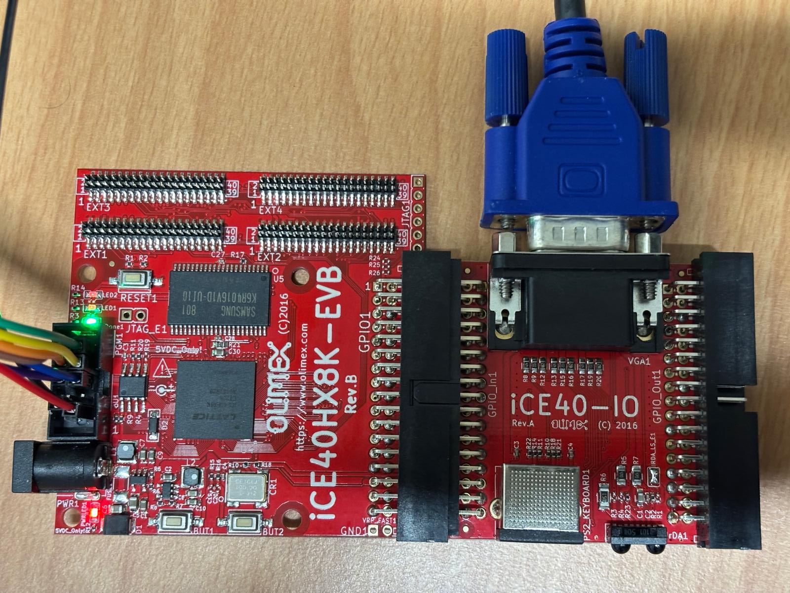

# iCE40HX8K-EVB FPGA Setup

## Introduction

The iCE40HX8K-EVB is a low cost development board for iCE40 FPGA family from Lattice Semiconductor.
The fun fact about this family of FPGAs is a complete end to end FOSS toolchain.
For detailed specs on the board check out the main [webpage](https://www.olimex.com/Products/FPGA/iCE40/iCE40HX8K-EVB/open-source-hardware).


### Features

- iCE40HX8K-CT256 FPGA 7680 Logic cells, 960 LABs, 128 K embedded RAM bits
- 512KB SRAM organized as 256Kx16bit 10ns
- 2MB Serial Flash
- 2 user status LEDs
- Programming successful status LED
- 2 user buttons
- Reset button
- Power jack for 5V DC external power supply
- PGM connector (all signals at PGM1 @ 3.3V DC)
- 34 pin connector bus
- 4 x 40 pin connectors for GPIOs
- 100 Mhz oscillator
- Power supply DCDC regulators
- Power supply status LED
- Dimentions: 65x67mm ~ (2.56x2.64)"

## Getting started with the Olimex iCE40HX8K-EVB on Linux

The iCE40HX8K dev board requires the following tools:

| Tool          | Function                  |
| :------------ | :------------------------ |
| yosys         | synthesis                 |
| nextpnr-ice40 | place and route toolchain |
| icepack       | bitstream generation      |
| icetime       | timing analysis report    |
| iceprog       | bitstream upload          |

### Installing the toolchain

All of tools mentioned above can be downloaded as a binary release. Download the latest release of
Linux x64 [OSS CAD Suite](https://github.com/YosysHQ/oss-cad-suite-build/releases) toolchain from Github.

```bash
# create dir Tools if it doesnt exist
[ -d ~/Tools ] || mkdir -p ~/Tools
cd ~/Tools

# download archive and move here
wget https://github.com/YosysHQ/oss-cad-suite-build/releases/download/<release-date>/oss-cad-suite-linux-arm64- <release-date>.tgz

# extract archive
tar -zxvf oss-cad-suite-linux-arm64-<release-date>.tgz -C ~/Tools

# rename folder
mv -v oss-cad-suite oss-cad-suite-<release-date>
```

### Setup FlashROM and OpenOCD

Install [flashrom](https://github.com/flashrom/flashrom) and [openOCD]() if you want to program the
device using SPI and JTAG interfaces.

```bash
sudo dnf install flashrom
sudo dnf install openocd
```

## Powering up the iCE40HX8K

The iCE40HX8K can be simply powered up by providing 5V DC via the barrel power jack. But this then
requires two cables i.e. one to power up the FPGA and the other to program the board. We need to do
a small modification on the open jumper labelled `3.3V_E1` by soldering it with a blod of solder or
adding a 0 Ohm resistor here. Now the FPGA can simply be powered on when we supply 3.3V via the UEXT
programming connector.

<!-- NOTE: insert image -->

### Setup the FTDI to the FPGA

There are several ways to program the iCE40HX8K booard. However in our case we will be using the SPI
mode on the [Adafruit FT232H breakout board](https://www.adafruit.com/product/2264).


The iCE40HX8K has a programming connector (PGM1) wil pin connection labelled like so.


```
       ┌──┐
   SSB │··│ SCK
   SDO │··│ SDI
  CRST │··  CDONE
   TXD │··│ RXD
   GND │··│ 3.3V
       └──┘
```

Connect the FT232H to the iCE40HX8K-EVB like so.

| Pin | iCE40HX8K-EVB | Pin | Adafruit |
| :-: | :------------ | :-: | :------- |
|  1  | 3.3V          | 3V  |          |
|  2  | GND           | GND |          |
|  3  | RXD           |     |          |
|  4  | TXD           |     |          |
|  5  | cdone         | D6  | D6       |
|  6  | creset        | D7  | D7       |
|  7  | sdi           | D2  | MISO     |
|  8  | sdo           | D1  | MOSI     |
|  9  | sck           | D0  | SCK/SCL  |
| 10  | cd/ssb        | D4  |          |

After this connect the FT232H to the computer via USB C. If everything is OK the green LED on the
iCE40HX8K-EVB should be turned ON now.

You can check if FT232H is available by running the command: `lsusb`.



## Programming the iCE40HX8K

The repository contains the following examples

| Folder | Description |
| :-- |:-- |
| led_blink | sequentially blink LED1 and LED2 on the board. |
| counter | sequentially blink 8 LEDs on the PMODs. |
<!-- | vga_demo1 | displays a small dot on the centre of the screen. | -->

To run any of the demos mentioned above move into the particular project directory and run the
Makefile targets.

- Synthesis:            `make synthesis`
- Place and Route:      `make implementation`
- Bitstream generation: `make bitstream`
- Upload bitstream:     `make upload`


<!-- ## Sources -->
<!-- - [1](https://github.com/plex1/raspice40) -->
<!-- - [2](https://hedmen.org/icestorm-doc/icestorm.html#Pin-mappings) -->
<!-- - [3](https://ihateyour.cloud/post/20200604-1.html) -->
<!-- - [4](https://bitbucket.org/cocoacrumbselectronics/ice40hx1k-evb-demo/src/master/) -->
<!-- - [5](https://github.com/Dreadrik/fpga-stopwatch) -->
<!-- - [6](https://gist.github.com/Forty-Bot/ea32c43c0e451ffe0eb155cc14305947) -->
<!-- - [7](https://github.com/hdl/constraints/blob/main/board/iCE40-HX8K/constraints.pcf) -->
https://github.com/YosysHQ/nextpnr-bench/blob/master/ice40/design02-hx8k.pcf
